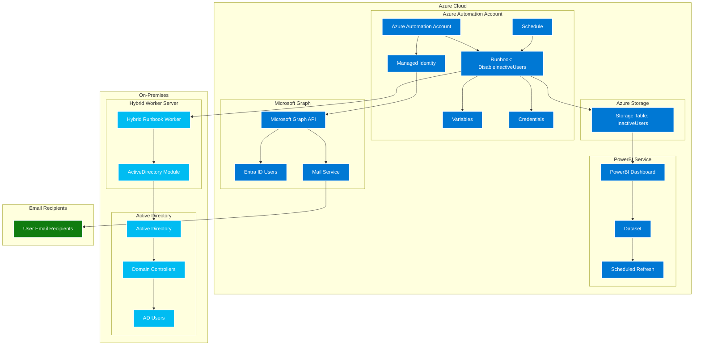
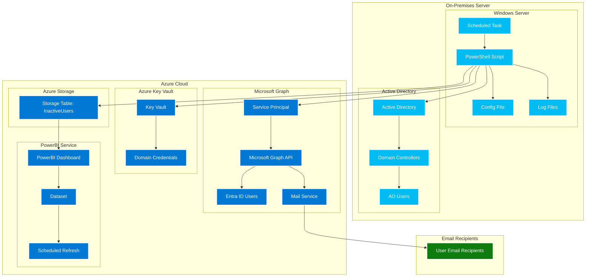
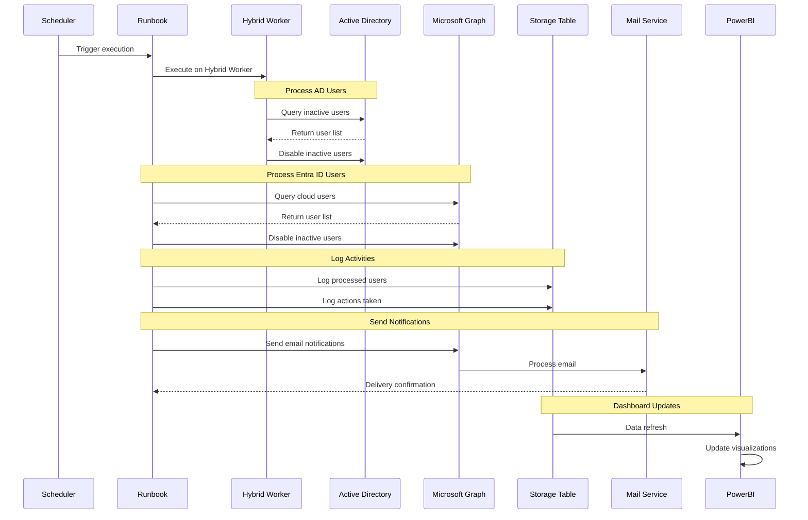
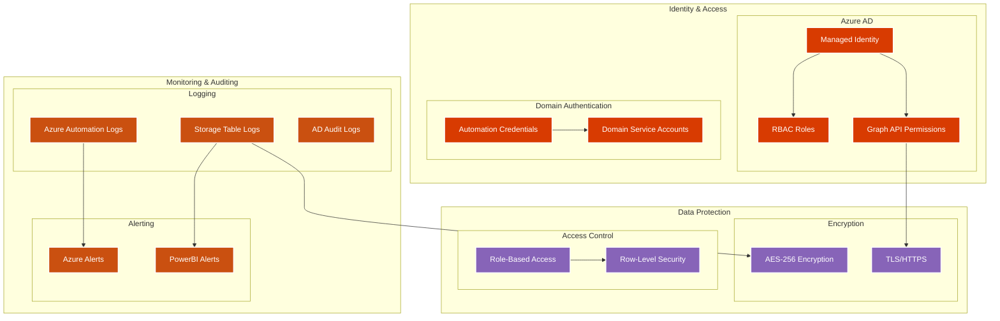
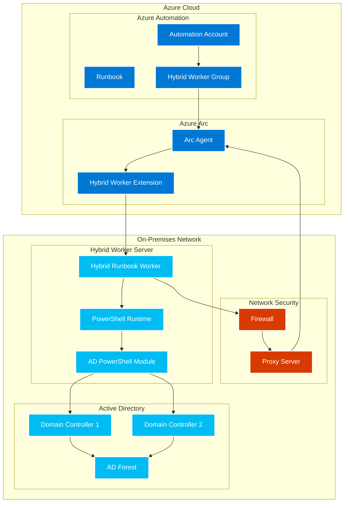
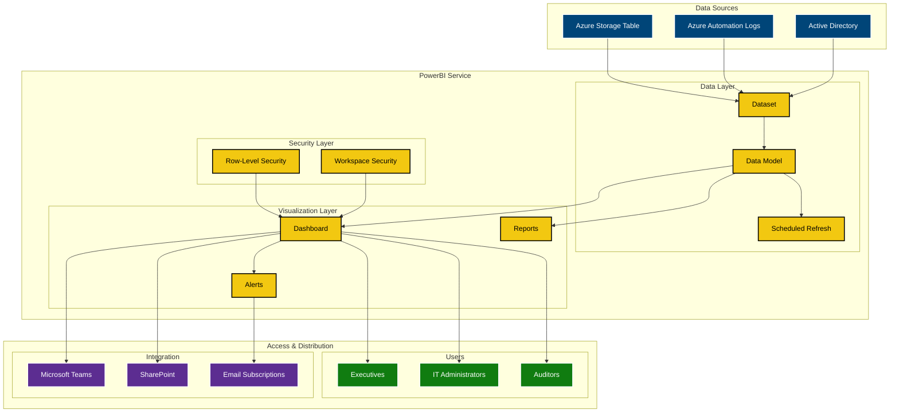
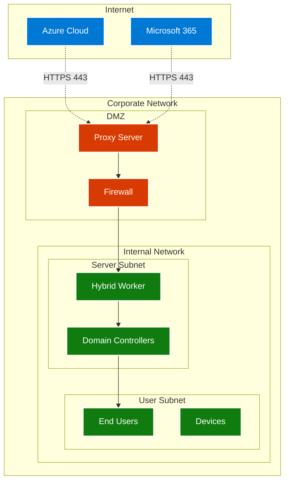
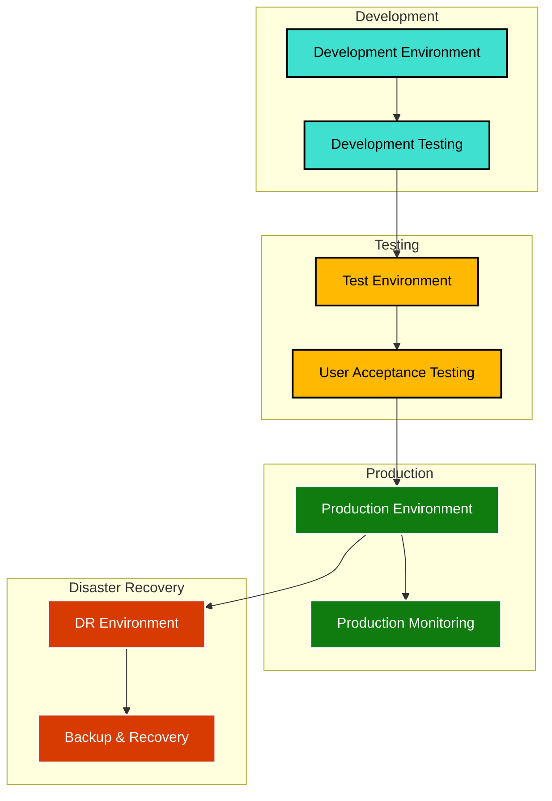

# Architecture Diagrams

This document contains architecture diagrams for both the on-premises and Azure Automation versions of the Disable Inactive Users solution.

## Azure Automation Architecture

## On-Premises Architecture (Legacy)

## Data Flow Diagram

## Security Architecture

## Hybrid Worker Architecture

## PowerBI Dashboard Architecture

## Network Architecture

## Deployment Architecture

## Key Architecture Benefits

### Azure Automation Architecture
- **Managed Identity**: Eliminates credential management overhead
- **Hybrid Worker**: Secure bridge between cloud and on-premises
- **Centralized Management**: Single pane of glass for configuration
- **Scalability**: Automatic scaling based on workload
- **High Availability**: Built-in redundancy and failover

### Security Architecture
- **Zero Trust**: Principle of least privilege access
- **Encryption**: Data encrypted in transit and at rest
- **Audit Trail**: Complete logging of all activities
- **Multi-Factor Authentication**: Required for administrative access
- **Role-Based Access**: Granular permission control

### Monitoring Architecture
- **Real-time Dashboards**: Live monitoring of system health
- **Predictive Analytics**: Identify trends and patterns
- **Automated Alerts**: Proactive issue detection
- **Compliance Reporting**: Automated compliance documentation
- **Performance Metrics**: Track system performance over time

These diagrams provide a comprehensive view of the solution architecture, helping stakeholders understand the system design, data flow, and security considerations.
