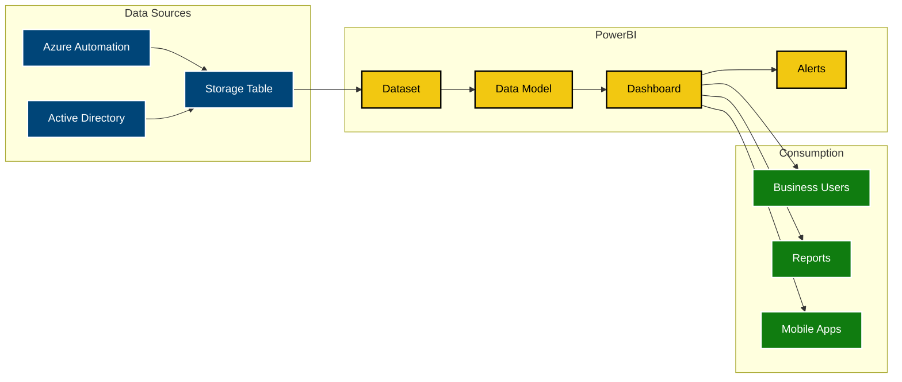

# PowerBI Dashboard Setup for Inactive Users Data

This guide explains how to create a PowerBI dashboard to visualize the inactive users data stored in Azure Storage Table.

## Overview

The PowerBI dashboard will provide:
- **User Activity Trends**: Track inactive users over time
- **Domain Analysis**: Compare activity across different domains
- **Action Tracking**: Monitor disabled accounts and notifications sent
- **Compliance Reporting**: Generate reports for compliance audits
- **Real-time Monitoring**: Near real-time view of processing results

### Data Flow Architecture



## Prerequisites

1. **PowerBI Pro License**: Required for sharing dashboards
2. **Azure Storage Account**: Where the inactive users data is stored
3. **PowerBI Desktop**: For creating and editing dashboards
4. **Azure Storage Account Access**: Read permissions to the storage table

## Setting Up the PowerBI Dashboard

### Step 1: Install PowerBI Desktop

1. Download PowerBI Desktop from [Microsoft PowerBI](https://powerbi.microsoft.com/desktop/)
2. Install and launch PowerBI Desktop
3. Sign in with your Microsoft 365 account

### Step 2: Connect to Azure Storage Table

1. **Open PowerBI Desktop**
2. Click **Get Data** > **More**
3. Search for and select **Azure Table Storage**
4. Click **Connect**

### Step 3: Configure Data Source

1. **Storage Account Name**: Enter your storage account name
2. **Account Key**: Enter your storage account key (or use managed identity)
3. **Table Name**: Enter "InactiveUsers" (or your configured table name)
4. Click **OK**

### Step 4: Transform Data

1. **Open Power Query Editor**
2. **Filter Data**: Remove any test or invalid entries
3. **Data Types**: Ensure proper data types:
   - `ProcessedDate`: DateTime
   - `LastLogon`: DateTime
   - `DaysInactive`: Whole Number
   - `Action`: Text
   - `AccountType`: Text

4. **Add Calculated Columns**:
   ```powerquery
   // Add Month-Year column for trending
   MonthYear = Date.ToText([ProcessedDate], "MMM yyyy")
   
   // Add Risk Category
   RiskCategory = if [DaysInactive] >= 180 then "High Risk"
                 else if [DaysInactive] >= 90 then "Medium Risk"
                 else "Low Risk"
   
   // Add Action Category
   ActionCategory = if Text.StartsWith([Action], "Disabled") then "Disabled"
                   else if Text.StartsWith([Action], "Notified") then "Notified"
                   else if Text.StartsWith([Action], "TEST") then "Test"
                   else "Other"
   ```

5. **Apply Changes** and **Close & Apply**

### Step 5: Create Dashboard Visualizations

#### 1. User Activity Overview (Cards)
- **Total Users Processed**: Count of all records
- **Users Disabled**: Count where Action starts with "Disabled"
- **Notifications Sent**: Count where Action starts with "Notified"
- **Average Days Inactive**: Average of DaysInactive

#### 2. Activity Trend (Line Chart)
- **X-axis**: ProcessedDate (by month)
- **Y-axis**: Count of users
- **Legend**: ActionCategory
- **Title**: "User Activity Trend Over Time"

#### 3. Domain Analysis (Clustered Bar Chart)
- **Y-axis**: AccountType
- **X-axis**: Count of users
- **Legend**: ActionCategory
- **Title**: "Activity by Domain/Account Type"

#### 4. Risk Distribution (Pie Chart)
- **Values**: Count of users
- **Legend**: RiskCategory
- **Title**: "Users by Risk Category"

#### 5. Days Inactive Distribution (Histogram)
- **X-axis**: DaysInactive (binned)
- **Y-axis**: Count of users
- **Title**: "Distribution of Days Inactive"

#### 6. Recent Actions (Table)
- **Columns**: DisplayName, UserPrincipalName, AccountType, Action, ProcessedDate, DaysInactive
- **Filter**: Last 30 days
- **Sort**: ProcessedDate descending
- **Title**: "Recent Actions"

#### 7. Compliance Summary (Matrix)
- **Rows**: AccountType
- **Columns**: ActionCategory
- **Values**: Count of users
- **Title**: "Compliance Actions by Account Type"

### Step 6: Add Filters and Slicers

1. **Date Range Slicer**: Filter by ProcessedDate
2. **Account Type Slicer**: Filter by AccountType (AD, EntraID)
3. **Action Category Slicer**: Filter by ActionCategory
4. **Risk Category Slicer**: Filter by RiskCategory

### Step 7: Format and Style

1. **Apply Corporate Theme**: Use your organization's colors
2. **Add Company Logo**: Insert logo in header
3. **Consistent Formatting**: Use consistent fonts and colors
4. **Add Tooltips**: Provide additional context on hover

## Sample DAX Measures

Add these measures to enhance your dashboard:

```dax
// Total Users Processed
Total Users = COUNTROWS('InactiveUsers')

// Users Disabled This Month
Users Disabled This Month = 
CALCULATE(
    COUNTROWS('InactiveUsers'),
    'InactiveUsers'[ActionCategory] = "Disabled",
    'InactiveUsers'[ProcessedDate] >= STARTOFMONTH(TODAY()),
    'InactiveUsers'[ProcessedDate] < STARTOFMONTH(TODAY()) + 1
)

// Average Days Inactive
Avg Days Inactive = AVERAGE('InactiveUsers'[DaysInactive])

// Notification Effectiveness
Notification Rate = 
DIVIDE(
    CALCULATE(COUNTROWS('InactiveUsers'), 'InactiveUsers'[ActionCategory] = "Notified"),
    CALCULATE(COUNTROWS('InactiveUsers'), 'InactiveUsers'[ActionCategory] = "Disabled")
)

// Month over Month Change
MoM Change = 
VAR CurrentMonth = CALCULATE(COUNTROWS('InactiveUsers'), MONTH('InactiveUsers'[ProcessedDate]) = MONTH(TODAY()))
VAR PreviousMonth = CALCULATE(COUNTROWS('InactiveUsers'), MONTH('InactiveUsers'[ProcessedDate]) = MONTH(TODAY()) - 1)
RETURN DIVIDE(CurrentMonth - PreviousMonth, PreviousMonth)

// High Risk Users
High Risk Users = 
CALCULATE(
    COUNTROWS('InactiveUsers'),
    'InactiveUsers'[DaysInactive] >= 180,
    'InactiveUsers'[ActionCategory] <> "Disabled"
)
```

## Automated Data Refresh

### Option 1: PowerBI Service (Recommended)

1. **Publish to PowerBI Service**:
   - File > Publish > To PowerBI
   - Select your workspace

2. **Configure Data Source**:
   - Go to PowerBI Service
   - Navigate to your dataset
   - Click **Settings** > **Data source credentials**
   - Enter Azure Storage credentials

3. **Schedule Refresh**:
   - Click **Schedule refresh**
   - Set refresh frequency (e.g., daily at 6 AM)
   - Configure failure notifications

### Option 2: PowerBI Gateway (For On-Premises)

1. **Install PowerBI Gateway** on a server with network access
2. **Configure Data Sources** in the gateway
3. **Schedule Refresh** through PowerBI Service

## Dashboard Distribution

### Option 1: PowerBI Workspace

1. **Create Workspace**: For your team or organization
2. **Share Dashboard**: With specific users or groups
3. **Set Permissions**: View, edit, or admin rights

### Option 2: PowerBI App

1. **Create App**: Package dashboard for wider distribution
2. **Configure App**: Set navigation and branding
3. **Publish App**: Make available to users

### Option 3: Embedded Dashboard

1. **PowerBI Embedded**: Integrate into existing applications
2. **SharePoint Integration**: Embed in SharePoint sites
3. **Teams Integration**: Add as tab in Microsoft Teams

## Alerts and Notifications

Set up alerts for key metrics:

1. **High Risk Users Alert**:
   - Trigger when high-risk users exceed threshold
   - Send to IT security team

2. **Processing Failure Alert**:
   - Trigger when no new data for 48 hours
   - Send to automation team

3. **Unusual Activity Alert**:
   - Trigger when disabled users spike
   - Send to management team

## Security Considerations

1. **Row-Level Security**: Restrict data access by department or domain
2. **Sensitive Data**: Mask or exclude sensitive user information
3. **Audit Trail**: Track who accessed the dashboard
4. **Data Retention**: Set appropriate retention policies

## Sample Dashboard Layout

```
+------------------+------------------+------------------+
|   Total Users    | Users Disabled  | Notifications    |
|      1,234       |       45        |       128        |
+------------------+------------------+------------------+
|                Activity Trend Over Time                |
|  [Line chart showing monthly trends]                  |
+------------------+------------------+------------------+
| Domain Analysis  |              | Risk Distribution   |
| [Bar chart]      |   Filters    | [Pie chart]        |
|                  |   - Date     |                    |
|                  |   - Domain   |                    |
|                  |   - Action   |                    |
+------------------+------------------+------------------+
|            Recent Actions Table                       |
|  [Table showing latest processed users]               |
+-------------------------------------------------------+
```

## PowerBI Template

Create a PowerBI template (.pbit file) that others can use:

1. **Create Template**:
   - File > Export > PowerBI Template
   - Add parameter for storage account details

2. **Share Template**:
   - Distribute .pbit file to other teams
   - Include setup instructions

3. **Template Parameters**:
   - Storage Account Name
   - Storage Account Key
   - Table Name
   - Date Range

## Troubleshooting

### Common Issues

1. **Connection Failures**:
   - Verify storage account credentials
   - Check network connectivity
   - Validate table name

2. **Data Type Errors**:
   - Ensure proper data types in Power Query
   - Handle null values appropriately

3. **Performance Issues**:
   - Limit date range for large datasets
   - Use query folding where possible
   - Consider data aggregation

4. **Refresh Failures**:
   - Check gateway connectivity
   - Verify credentials haven't expired
   - Monitor refresh history

### Best Practices

1. **Data Modeling**:
   - Create proper relationships
   - Use appropriate data types
   - Implement calculated columns efficiently

2. **Performance**:
   - Use DirectQuery for large datasets
   - Implement incremental refresh
   - Optimize DAX measures

3. **Visualization**:
   - Choose appropriate chart types
   - Use consistent colors and formatting
   - Add meaningful titles and labels

4. **Maintenance**:
   - Regular data source updates
   - Monitor dashboard performance
   - Update visualizations based on feedback

## Integration with Azure Automation

Enhance the dashboard with Azure Automation data:

1. **Runbook Execution Data**:
   - Connect to Azure Monitor logs
   - Show runbook success/failure rates
   - Display execution duration

2. **Hybrid Worker Health**:
   - Monitor worker availability
   - Track performance metrics
   - Show connectivity status

3. **Error Tracking**:
   - Display error trends
   - Show common failure reasons
   - Track resolution times

This PowerBI dashboard provides comprehensive visibility into your inactive user management process, helping you make data-driven decisions and ensure compliance with security policies.
