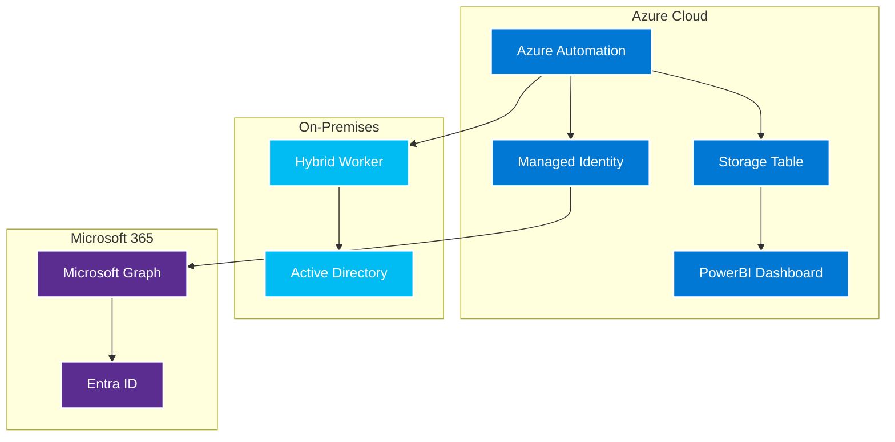

# Inactivity Management Solution

## Overview

This solution provides comprehensive management of inactive user accounts across Active Directory and Entra ID (Azure AD). It identifies inactive users, sends notifications, and automatically disables accounts based on configurable policies.

## Features

- **Multi-Platform Support**: Handles Active Directory, Entra ID cloud users, and Entra ID guest users
- **Multi-Domain Active Directory**: Supports multiple AD domains with unique credentials per domain
- **Secure Credential Management**: Uses Azure Key Vault for storing domain credentials
- **Modern Microsoft Graph API**: Uses the latest Microsoft Graph PowerShell SDK
- **Accurate Inactivity Detection**: Uses LastLogonTimestamp for AD users and sign-in logs for Entra users
- **Cloud-Only Focus**: Processes only cloud-native Entra users (excludes hybrid/synced accounts)
- **Configurable Inactivity Period**: Default 90 days, fully customizable
- **Email Notifications**: Sends warnings via Microsoft Graph (no SMTP required)
- **Azure Storage Logging**: Logs all actions to Azure Storage Table
- **Flexible Exclusions**: Exclude users by AD groups, OUs, or user properties
- **Test Mode**: Safe testing without making actual changes

## Architecture

The solution supports both on-premises and Azure Automation deployments:

### Azure Automation Architecture


## Quick Start

### Azure Automation Version (Recommended)

1. **Install Prerequisites**:
   ```powershell
   .\Install-Prerequisites.ps1
   ```

2. **Configure Azure Automation**:
   ```powershell
   .\Setup-AzureAutomation.ps1
   ```

3. **Set up Hybrid Worker** (for AD connectivity):
   ```powershell
   .\Setup-HybridWorker.ps1
   ```

### On-Premises Version

1. **Install Prerequisites**:
   ```powershell
   .\Install-Prerequisites.ps1
   ```

2. **Configure Settings**:
   Edit `Config-DisableInactiveUsers.ps1` with your environment settings

3. **Set up Credentials**:
   ```powershell
   .\Setup-KeyVaultCredentials.ps1
   ```

4. **Create Scheduled Task**:
   ```powershell
   .\Setup-ScheduledTask.ps1
   ```

## Documentation

- **[README-AzureAutomation.md](README-AzureAutomation.md)** - Azure Automation version documentation
- **[Migration-Guide.md](Migration-Guide.md)** - Migration from on-premises to Azure Automation
- **[README-Testing.md](README-Testing.md)** - Testing documentation
- **[Architecture-Diagrams.md](Architecture-Diagrams.md)** - Architecture diagrams
- **[PowerBI-Dashboard-Setup.md](PowerBI-Dashboard-Setup.md)** - PowerBI dashboard setup

## Main Scripts

- **[AzureAutomation-DisableInactiveUsers.ps1](AzureAutomation-DisableInactiveUsers.ps1)** - Azure Automation runbook
- **[Disable-InactiveUsers.ps1](Disable-InactiveUsers.ps1)** - On-premises script
- **[Setup-AzureAutomation.ps1](Setup-AzureAutomation.ps1)** - Azure Automation setup
- **[Setup-HybridWorker.ps1](Setup-HybridWorker.ps1)** - Hybrid Worker setup

## Configuration

- **[Config-DisableInactiveUsers.ps1](Config-DisableInactiveUsers.ps1)** - On-premises configuration
- **[AzureAutomation-Config.ps1](AzureAutomation-Config.ps1)** - Azure Automation configuration

## Testing

Run the comprehensive test suite:

```powershell
.\Install-TestDependencies.ps1
.\Test-Runner.ps1
Invoke-AllTests -Coverage
```

## PowerBI Dashboard

Set up comprehensive monitoring dashboards:

```powershell
# See PowerBI-Dashboard-Setup.md for detailed instructions
```

## Support

For issues and questions:
- Check the respective README files
- Review the troubleshooting sections
- Use the test suite to validate configuration
- Check Azure Automation or scheduled task logs

## License

This solution is provided under the MIT License.
