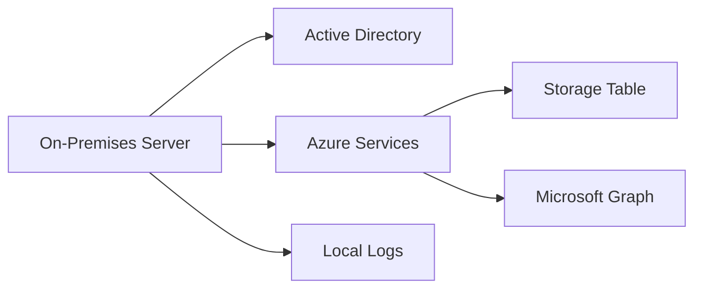
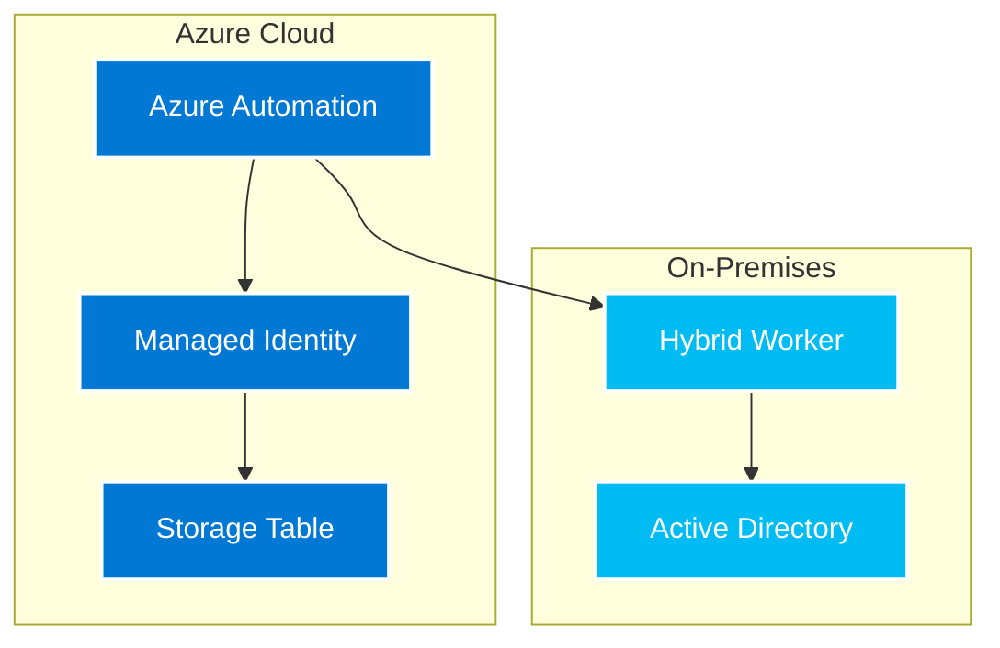

# Migration Guide: On-Premises to Azure Automation

This guide helps you migrate from the original on-premises PowerShell script solution to the Azure Automation version.

## Overview

The Azure Automation version provides several advantages over the on-premises version:
- **Managed Identity Authentication**: No need to manage service principal credentials
- **Cloud-Native**: Runs entirely in Azure without on-premises dependencies
- **Centralized Management**: Configuration stored in Azure Automation variables
- **Enhanced Security**: Uses Azure's security features and managed identity
- **Better Monitoring**: Integrated with Azure monitoring and logging
- **Automatic Updates**: PowerShell modules updated automatically

### Architecture Comparison

#### On-Premises Architecture


#### Azure Automation Architecture


The Azure Automation architecture provides better security, scalability, and management capabilities.

## Pre-Migration Checklist

### 1. Document Current Configuration
Before migrating, document your current on-premises configuration:

```powershell
# Export current configuration from Config-DisableInactiveUsers.ps1
$currentConfig = @{
    DaysInactive = 90
    NotificationDays = @(14, 7, 3)
    StorageAccountName = "your-current-storage"
    StorageAccountKey = "your-current-key"
    SenderEmail = "current-sender@company.com"
    ADDomains = @(
        # Document all configured domains
    )
    ExcludeGroups = @(
        # Document all exclusion groups
    )
    ExcludeOUs = @(
        # Document all exclusion OUs
    )
    ExcludeUserProperty = "Department"
    ExcludeUserPropertyValue = "IT"
    TestMode = $true
}

# Save this configuration for reference
$currentConfig | ConvertTo-Json | Out-File "CurrentConfiguration.json"
```

### 2. Backup Current Data
Export current Azure Storage Table data:

```powershell
# Connect to current storage account
$ctx = New-AzStorageContext -StorageAccountName "your-storage" -StorageAccountKey "your-key"
$table = Get-AzStorageTable -Name "InactiveUsers" -Context $ctx

# Export current data
$entities = Get-AzTableRow -Table $table.CloudTable
$entities | Export-Csv "CurrentUserData.csv" -NoTypeInformation
```

### 3. Verify Current Scheduled Tasks
Document your current scheduled task configuration:

```powershell
# Check current scheduled task
Get-ScheduledTask -TaskName "Disable-InactiveUsers" | Format-List
```

## Migration Steps

### Step 1: Create Azure Resources

1. **Create Azure Automation Account**:
   - Enable system-assigned managed identity
   - Choose appropriate region
   - Configure resource group

2. **Verify Storage Account**:
   - Use existing storage account or create new one
   - Ensure proper permissions for Azure Automation

### Step 2: Convert Configuration

Create your Azure Automation configuration using the template:

```powershell
# Convert your on-premises config to Azure Automation format
$AzureAutomationConfig = @{
    # Azure Resources
    SubscriptionId = "your-subscription-id"
    ResourceGroupName = "your-resource-group"
    AutomationAccountName = "your-automation-account"
    
    # Storage (can reuse existing)
    StorageAccountName = $currentConfig.StorageAccountName
    StorageAccountKey = $currentConfig.StorageAccountKey
    TableName = "InactiveUsers"
    
    # Email (same as before)
    SenderEmail = $currentConfig.SenderEmail
    
    # Convert AD domains
    DomainCredentials = @{
        "contoso.com" = @{
            Username = "CONTOSO\svc-automation"
            Password = "your-domain-password"
        }
        # Add other domains...
    }
    
    # Convert exclusions to comma-separated strings
    ExcludeGroups = ($currentConfig.ExcludeGroups -join ",")
    ExcludeOUs = ($currentConfig.ExcludeOUs -join ",")
    ExcludeUserProperty = $currentConfig.ExcludeUserProperty
    ExcludeUserPropertyValue = $currentConfig.ExcludeUserPropertyValue
    
    # Schedule settings
    CreateSchedule = $true
    ScheduleFrequency = "Daily"  # Convert from your current schedule
    ScheduleTime = "02:00"       # Convert from your current schedule
}
```

### Step 3: Run Azure Automation Setup

```powershell
# Run the setup script
.\Setup-AzureAutomation.ps1 @AzureAutomationConfig
```

### Step 4: Configure Managed Identity Permissions

The setup script will provide commands to configure Graph API permissions. Run these commands:

```powershell
# Example commands (actual commands provided by setup script)
Connect-MgGraph -Scopes 'Application.ReadWrite.All', 'AppRoleAssignment.ReadWrite.All'
$managedIdentity = Get-MgServicePrincipal -Filter "objectId eq 'your-managed-identity-id'"
$graphApp = Get-MgServicePrincipal -Filter "appId eq '00000003-0000-0000-c000-000000000000'"

# Grant required permissions
$permissions = @('User.ReadWrite.All', 'Mail.Send', 'AuditLog.Read.All', 'Directory.Read.All')
foreach ($permission in $permissions) {
    $appRole = $graphApp.AppRoles | Where-Object { $_.Value -eq $permission }
    New-MgServicePrincipalAppRoleAssignment -ServicePrincipalId $managedIdentity.Id -PrincipalId $managedIdentity.Id -ResourceId $graphApp.Id -AppRoleId $appRole.Id
}
```

### Step 5: Test the Migration

1. **Run in Test Mode**:
```powershell
Start-AzAutomationRunbook -AutomationAccountName "your-automation-account" -ResourceGroupName "your-resource-group" -Name "DisableInactiveUsers" -Parameters @{TestMode=$true; DaysInactive=90}
```

2. **Compare Results**:
   - Check Azure Storage Table for processed users
   - Compare with previous run results
   - Verify same users are being identified

3. **Validate Notifications**:
   - Test email notifications work correctly
   - Verify notification timing and content

### Step 6: Disable On-Premises Solution

1. **Disable Scheduled Task**:
```powershell
Disable-ScheduledTask -TaskName "Disable-InactiveUsers"
```

2. **Document Cutover**:
   - Record migration date
   - Note any configuration changes
   - Update documentation

## Key Differences

### Authentication
- **On-Premises**: Used service principal with client secret
- **Azure Automation**: Uses managed identity (more secure)

### Configuration
- **On-Premises**: File-based configuration (Config-DisableInactiveUsers.ps1)
- **Azure Automation**: Azure Automation variables and credentials

### Credentials
- **On-Premises**: Azure Key Vault for domain credentials
- **Azure Automation**: Azure Automation credentials store

### Scheduling
- **On-Premises**: Windows Task Scheduler
- **Azure Automation**: Azure Automation schedules

### Monitoring
- **On-Premises**: Local log files + Azure Storage
- **Azure Automation**: Azure Automation logs + Azure Storage

## Configuration Mapping

| On-Premises | Azure Automation | Notes |
|-------------|------------------|-------|
| Config-DisableInactiveUsers.ps1 | Azure Automation Variables | Configuration now stored in Azure |
| Key Vault credentials | Azure Automation Credentials | Named AD-DOMAINNAME |
| Scheduled Task | Azure Automation Schedule | More flexible scheduling options |
| Local log files | Azure Automation Logs | Centralized logging |
| Manual module updates | Automatic module updates | Modules updated automatically |

## Testing Strategy

### Phase 1: Parallel Testing
1. Run both systems in test mode
2. Compare results for consistency
3. Verify same users are identified
4. Check notification delivery

### Phase 2: Limited Production
1. Disable on-premises scheduled task
2. Run Azure Automation in production with higher DaysInactive value
3. Monitor for 1-2 weeks
4. Gradually reduce DaysInactive to target value

### Phase 3: Full Production
1. Switch to normal DaysInactive value
2. Enable regular schedule
3. Monitor for issues
4. Decommission on-premises solution

## Rollback Plan

If issues arise during migration:

1. **Immediate Rollback**:
   - Re-enable on-premises scheduled task
   - Disable Azure Automation schedule
   - Notify stakeholders

2. **Data Consistency**:
   - Both systems use same Azure Storage Table
   - No data loss during rollback
   - May have duplicate log entries

3. **Fix and Retry**:
   - Address identified issues
   - Test thoroughly
   - Plan new migration window

## Post-Migration Tasks

### 1. Update Documentation
- Update runbooks and procedures
- Modify monitoring dashboards
- Update contact information

### 2. Training
- Train administrators on Azure Automation
- Update operational procedures
- Create troubleshooting guides

### 3. Monitoring
- Set up Azure alerts for runbook failures
- Monitor Azure Storage Table growth
- Track email delivery success

### 4. Cleanup
- Remove on-premises files after successful migration
- Clean up old scheduled tasks
- Archive old log files
- **Set up PowerBI dashboard** for better data visualization

### 5. PowerBI Dashboard Setup
- Create PowerBI dashboard for enhanced monitoring
- Configure automated data refresh
- Set up alerts and notifications
- Train users on dashboard usage

See `PowerBI-Dashboard-Setup.md` for detailed instructions.

## Common Migration Issues

### Issue: Module Import Failures
**Cause**: Modules not fully installed in Azure Automation
**Solution**: Wait for modules to complete installation, check module status

### Issue: Permission Errors
**Cause**: Managed identity lacks required Graph API permissions
**Solution**: Verify and re-grant API permissions

### Issue: Domain Connection Failures
**Cause**: Network connectivity or credential issues
**Solution**: Verify domain credentials, check network connectivity

### Issue: Different Results
**Cause**: Timing differences, configuration mismatches
**Solution**: Compare configurations, run at same time for comparison

## Best Practices

1. **Migrate During Low Activity**: Choose maintenance windows
2. **Test Thoroughly**: Run parallel testing for at least one full cycle
3. **Document Everything**: Keep detailed migration notes
4. **Monitor Closely**: Watch for issues during first weeks
5. **Have Rollback Ready**: Keep on-premises solution available for quick rollback

## Support Resources

- Azure Automation documentation
- Microsoft Graph API documentation
- Azure Storage Table documentation
- Community forums and support

## Conclusion

Migrating to Azure Automation provides better security, reliability, and management capabilities. Follow this guide carefully, test thoroughly, and maintain good documentation throughout the process.
