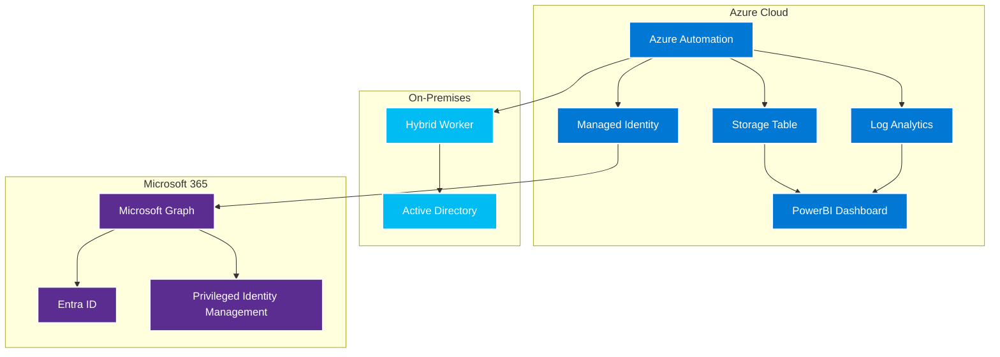
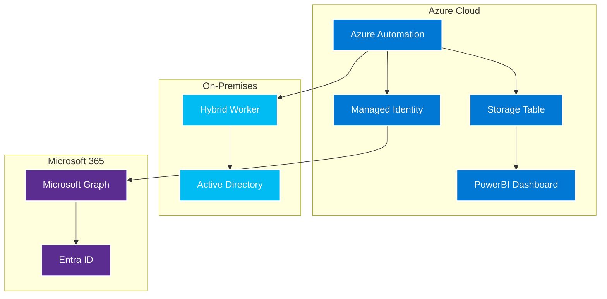

# IAM (Identity and Access Management) Solutions

This repository contains comprehensive Identity and Access Management solutions for Azure and Microsoft 365 environments.

## 🚀 Solutions Overview

### 1. [Inactivity Management](InactivityManagement/) 
**Automated management of inactive user accounts**
- Identifies and disables inactive users in Active Directory and Entra ID
- Configurable notification system with email warnings
- Supports both on-premises and Azure Automation deployments
- Comprehensive PowerBI dashboards for monitoring
- **Status**: ✅ Complete and Production-Ready

### 2. [Role Assignment Monitoring](RoleAssignmentMonitoring/)
**Monitor and govern Azure and Entra ID role assignments**
- Real-time monitoring of Azure RBAC and Entra ID role assignments
- Privileged Identity Management (PIM) tracking
- Compliance reporting and anomaly detection
- Automated remediation capabilities
- **Status**: 🚧 In Development

## � Repository Structure

```
IAM/
├── InactivityManagement/          # Inactive user management solution
│   ├── Scripts/                   # PowerShell scripts
│   ├── Tests/                     # Comprehensive test suite
│   ├── Documentation/             # Solution documentation
│   └── README.md                  # Solution overview
├── RoleAssignmentMonitoring/      # Role assignment monitoring solution
│   ├── Scripts/                   # PowerShell scripts
│   ├── Tests/                     # Test suite
│   ├── Documentation/             # Solution documentation
│   └── README.md                  # Solution overview
└── README.md                      # This file
```

## 🎯 Quick Start

### For Inactivity Management
```powershell
cd InactivityManagement
.\Install-Prerequisites.ps1
.\Setup-AzureAutomation.ps1
```

### For Role Assignment Monitoring
```powershell
cd RoleAssignmentMonitoring
.\Install-Prerequisites.ps1
.\Setup-AzureAutomation.ps1
```

## 🏗️ Architecture

Both solutions follow a similar cloud-native architecture:



## 🔧 Common Features

### Security
- **Managed Identity Authentication** - No stored credentials
- **Least Privilege Access** - Minimal required permissions
- **Secure Storage** - Encrypted data at rest and in transit
- **Comprehensive Audit Logging** - Full activity tracking

### Monitoring & Reporting
- **PowerBI Dashboards** - Rich visualization and analytics
- **Real-time Alerts** - Configurable notification system
- **Compliance Reports** - Support for various frameworks
- **Historical Tracking** - Long-term trend analysis

### Deployment Options
- **Azure Automation** - Cloud-native, recommended approach
- **On-Premises** - Traditional PowerShell execution
- **Hybrid** - Combined cloud and on-premises deployment

### Quality Assurance
- **Comprehensive Testing** - Pester test suites for all components
- **CI/CD Ready** - GitHub Actions and Azure DevOps integration
- **Documentation** - Complete setup and troubleshooting guides

## 📊 Solution Comparison

| Feature | Inactivity Management | Role Assignment Monitoring |
|---------|----------------------|---------------------------|
| **Purpose** | Manage inactive users | Monitor role assignments |
| **Scope** | AD + Entra ID Users | Azure RBAC + Entra ID Roles |
| **Actions** | Disable accounts | Alert + Remediate |
| **Reporting** | User activity analytics | Role assignment analytics |
| **Compliance** | Account lifecycle | Privileged access governance |
| **Status** | ✅ Production Ready | 🚧 In Development |

## 🚀 Getting Started

### Prerequisites
- Azure subscription with appropriate permissions
- PowerShell 5.1 or later
- Azure Automation Account (recommended)
- Microsoft Graph API permissions

### Installation Steps
1. **Choose a solution** - Navigate to the appropriate folder
2. **Install prerequisites** - Run the installation script
3. **Configure settings** - Edit configuration files
4. **Deploy to Azure** - Run setup scripts
5. **Test and validate** - Use the test suite
6. **Set up monitoring** - Configure PowerBI dashboards

## 📚 Documentation

### Inactivity Management
- [Solution Overview](InactivityManagement/README.md)
- [Azure Automation Setup](InactivityManagement/README-AzureAutomation.md)
- [Migration Guide](InactivityManagement/Migration-Guide.md)
- [Testing Guide](InactivityManagement/README-Testing.md)
- [PowerBI Dashboard Setup](InactivityManagement/PowerBI-Dashboard-Setup.md)

### Role Assignment Monitoring
- [Solution Overview](RoleAssignmentMonitoring/README.md)
- [Architecture Guide](RoleAssignmentMonitoring/Documentation/Architecture-Guide.md)
- [Configuration Guide](RoleAssignmentMonitoring/Documentation/Configuration-Guide.md)
- [API Reference](RoleAssignmentMonitoring/Documentation/API-Reference.md)

## 🧪 Testing

Both solutions include comprehensive test suites:

```powershell
# Test Inactivity Management
cd InactivityManagement
.\Install-TestDependencies.ps1
.\Test-Runner.ps1
Invoke-AllTests -Coverage

# Test Role Assignment Monitoring
cd RoleAssignmentMonitoring
.\Install-TestDependencies.ps1
.\Test-Runner.ps1
Invoke-AllTests -Coverage
```

## 🤝 Contributing

1. **Fork the repository**
2. **Create a feature branch** (`git checkout -b feature/amazing-feature`)
3. **Follow the coding standards** and add tests
4. **Update documentation** as needed
5. **Commit changes** (`git commit -m 'Add amazing feature'`)
6. **Push to branch** (`git push origin feature/amazing-feature`)
7. **Open a Pull Request**

### Development Guidelines
- Follow PowerShell best practices
- Add comprehensive tests for new features
- Update documentation for any changes
- Ensure security best practices are followed

## 📝 License

This project is licensed under the MIT License - see the [LICENSE](LICENSE) file for details.

## 🆘 Support

For issues and questions:
- **Check the documentation** in the respective solution folders
- **Review the troubleshooting guides**
- **Use the test suites** to validate configuration
- **Check Azure Automation logs** for runtime errors
- **Open an issue** in this repository

## 🗺️ Roadmap

### Short Term (Next 3 months)
- [ ] Complete Role Assignment Monitoring solution
- [ ] Add ARM templates for automated deployment
- [ ] Enhance PowerBI dashboards with more visualizations
- [ ] Add support for additional compliance frameworks

### Medium Term (3-6 months)
- [ ] Add Machine Learning for anomaly detection
- [ ] Implement automated remediation workflows
- [ ] Add support for multi-tenant scenarios
- [ ] Enhance monitoring and alerting capabilities

### Long Term (6+ months)
- [ ] Add integration with Security Information and Event Management (SIEM) systems
- [ ] Implement advanced analytics and reporting
- [ ] Add support for additional identity providers
- [ ] Develop REST API for integration with other systems

## 🏆 Acknowledgments

- Microsoft Graph API team for excellent documentation
- Azure Automation team for the powerful automation platform
- PowerShell community for best practices and guidance
- Contributors and users who provide feedback and improvements

---

**🎯 Ready to secure your identity infrastructure? Start with the [Inactivity Management](InactivityManagement/) solution today!**

## Versions Available

### 🆕 Azure Automation Version (Recommended)
- **Main Files**: `AzureAutomation-DisableInactiveUsers.ps1`, `Setup-AzureAutomation.ps1`
- **Documentation**: See `README-AzureAutomation.md`
- **Benefits**: Managed identity authentication, cloud-native, centralized management
- **PowerBI Dashboard**: Comprehensive data visualization and reporting
- **Migration Guide**: See `Migration-Guide.md` for transitioning from on-premises

### 📋 On-Premises Version (Legacy)
- **Main Files**: `Disable-InactiveUsers.ps1`, `Config-DisableInactiveUsers.ps1`
- **Documentation**: See below
- **Use Case**: For environments requiring on-premises execution

## Architecture Overview

The solution supports both on-premises and Azure Automation deployments:

### Azure Automation Architecture


For detailed architecture diagrams, see `Architecture-Diagrams.md`.

---

## Original On-Premises Documentation

This suite provides automated management of inactive user accounts across Active Directory and Entra ID (Azure AD).

## Features

- **Multi-Platform Support**: Handles Active Directory, Entra ID cloud users, and Entra ID guest users
- **Multi-Domain Active Directory**: Supports multiple AD domains with unique credentials per domain
- **Secure Credential Management**: Uses Azure Key Vault for storing domain credentials
- **Modern Microsoft Graph API**: Uses the latest Microsoft Graph PowerShell SDK
- **Accurate Inactivity Detection**: Uses LastLogonTimestamp for AD users and sign-in logs for Entra users
- **Cloud-Only Focus**: Processes only cloud-native Entra users (excludes hybrid/synced accounts)
- **Configurable Inactivity Period**: Default 90 days, fully customizable
- **Email Notifications**: Sends warnings via Microsoft Graph (no SMTP required)
- **Azure Storage Logging**: Logs all actions to Azure Storage Table
- **Flexible Exclusions**: Exclude users by AD groups, OUs, or user properties
- **Test Mode**: Safe testing without making actual changes

## Files Included

1. **Disable-InactiveUsers.ps1** - Main script
2. **Config-DisableInactiveUsers.ps1** - Configuration file template
3. **Setup-ScheduledTask.ps1** - Creates scheduled task for automation
4. **Install-Prerequisites.ps1** - Installs required PowerShell modules
5. **Setup-KeyVaultCredentials.ps1** - Configures Azure Key Vault credentials for domains

## Quick Start

### 1. Install Prerequisites
```powershell
# Run as Administrator
.\Install-Prerequisites.ps1
```

### 2. Configure Settings
Edit `Config-DisableInactiveUsers.ps1` with your environment settings:

```powershell
$Config = @{
    # Required Settings
    StorageAccountName = "yourstorageaccount"
    StorageAccountKey = "your-storage-account-key"
    SenderEmail = "admin@yourcompany.com"  # Must be valid Microsoft 365 user
    
    # Active Directory Domains Configuration
    ADDomains = @(
        @{
            Name = "contoso.com"
            KeyVaultName = "kv-contoso-prod"
            CredentialSecretName = "ad-admin-contoso"
        },
        @{
            Name = "fabrikam.com"
            KeyVaultName = "kv-fabrikam-prod"
            CredentialSecretName = "ad-admin-fabrikam"
        }
    )
    
    # Optional Settings
    DaysInactive = 90
    NotificationDays = @(14, 7, 3)
    ExcludeGroups = @("Domain Admins", "Service Accounts")
    ExcludeOUs = @("OU=Service Accounts,DC=domain,DC=com")
    TestMode = $true  # Set to $false for production
}
```

### 2.5. Set Up Key Vault Credentials
Configure Azure Key Vault credentials for each domain:

```powershell
# Configure domain credentials in Key Vault
$domainConfigs = @(
    @{
        Name = "contoso.com"
        KeyVaultName = "kv-contoso-prod"
        CredentialSecretName = "ad-admin-contoso"
        Username = "CONTOSO\svc-admin"
        Password = "P@ssw0rd123"
    },
    @{
        Name = "fabrikam.com"
        KeyVaultName = "kv-fabrikam-prod"
        CredentialSecretName = "ad-admin-fabrikam"
        Username = "FABRIKAM\svc-admin"
        Password = "P@ssw0rd456"
    }
)

.\Setup-KeyVaultCredentials.ps1 -DomainConfigs $domainConfigs
```

**Important**: Store credentials in this format in Key Vault: `username|password`

### 3. Test the Script
```powershell
# Test mode - no actual changes
$testDomains = @(
    @{Name="contoso.com"; KeyVaultName="kv-contoso"; CredentialSecretName="ad-admin-contoso"},
    @{Name="fabrikam.com"; KeyVaultName="kv-fabrikam"; CredentialSecretName="ad-admin-fabrikam"}
)
.\Disable-InactiveUsers.ps1 -TestMode -StorageAccountName "test" -StorageAccountKey "key" -SenderEmail "admin@yourcompany.com" -ADDomains $testDomains
```

### 4. Set Up Scheduled Task
```powershell
# Run as Administrator
.\Setup-ScheduledTask.ps1
```

## Configuration Options

### Basic Settings
- `DaysInactive`: Number of days before account is disabled (default: 90)
- `NotificationDays`: Array of days before disable to send warnings (default: 14, 7, 3)
- `TestMode`: Run without making changes (default: false)

### Email Settings
- `SenderEmail`: Microsoft 365 user email address for sending notifications (required)

### Azure Storage Settings
- `StorageAccountName`: Azure Storage Account name (required)
- `StorageAccountKey`: Azure Storage Account access key (required)
- `TableName`: Table name for logging (default: "InactiveUsers")

### Exclusion Settings
- `ExcludeGroups`: Array of AD group names to exclude
- `ExcludeOUs`: Array of organizational units to exclude
- `ExcludeUserProperty`: AD property to check for exclusion
- `ExcludeUserPropertyValue`: Value that excludes the user

## Inactivity Detection Methods

### Active Directory Users
- **LastLogonTimestamp**: Uses the `lastLogonTimestamp` attribute for more accurate cross-domain controller replication
- **Replicated Attribute**: This attribute is replicated across all domain controllers (unlike `lastLogonDate`)
- **Precision**: Provides better accuracy for distributed AD environments

### Entra ID Cloud Users
- **Sign-in Logs**: Uses Microsoft Graph audit sign-in logs via `Get-MgAuditLogSignIn`
- **Cloud-Only**: Processes only cloud-native users (excludes hybrid/synced accounts)
- **Hybrid Detection**: Skips accounts with `OnPremisesSyncEnabled` or `OnPremisesImmutableId` properties

### Why Separate AD and Entra Processing?
- **Avoid Duplicate Processing**: Prevents managing the same user twice (once in AD, once in Entra)
- **Appropriate Tools**: Uses AD-specific tools for on-premises accounts and Graph API for cloud accounts
- **Accurate Inactivity**: Uses the most appropriate last logon data source for each platform

## Usage Examples

### Basic Usage
```powershell
.\Disable-InactiveUsers.ps1 -StorageAccountName "mystorageaccount" -StorageAccountKey "key123" -SenderEmail "admin@company.com"
```

### With Exclusions
```powershell
.\Disable-InactiveUsers.ps1 -StorageAccountName "mystorageaccount" -StorageAccountKey "key123" -SenderEmail "admin@company.com" -ExcludeGroups @("IT Staff", "Executives") -ExcludeOUs @("OU=Service Accounts,DC=company,DC=com")
```

### Test Mode
```powershell
.\Disable-InactiveUsers.ps1 -StorageAccountName "mystorageaccount" -StorageAccountKey "key123" -SenderEmail "admin@company.com" -TestMode
```

## Requirements

### PowerShell Modules
- ActiveDirectory
- Microsoft.Graph.Authentication
- Microsoft.Graph.Users
- Microsoft.Graph.Mail
- Microsoft.Graph.Reports
- Az.Accounts
- Az.Storage
- Az.KeyVault
- AzTable

### Permissions Required
- **Active Directory**: User account management permissions in each domain
- **Microsoft Graph**: User.ReadWrite.All, AuditLog.Read.All, Mail.Send, Directory.Read.All
- **Azure Storage**: Read/write access to storage account
- **Azure Key Vault**: Get/List permissions for secrets containing domain credentials

### Network Requirements
- Access to all domain controllers across multiple domains
- Internet access for Microsoft Graph and Azure Storage
- Azure Key Vault access (vault.azure.net)
- Microsoft Graph API access (graph.microsoft.com)

## Security Considerations

1. **Service Account**: Use a dedicated service account with minimal required permissions
2. **Secure Storage**: Store the script and configuration files in a secure location
3. **Key Management**: Use Azure Key Vault for storing sensitive keys in production
4. **Logging**: Monitor the Azure Storage Table for audit trails
5. **Testing**: Always test thoroughly in a non-production environment first

## Troubleshooting

### Common Issues

1. **Module Import Errors**: Ensure all required modules are installed
2. **Permission Errors**: Verify account has appropriate AD and Azure permissions
3. **Network Connectivity**: Check firewall settings for Azure and SMTP access
4. **Authentication**: Ensure Azure AD authentication is working properly

### Log Files
- Script creates detailed log files with timestamp
- Check Azure Storage Table for user action history
- Monitor scheduled task execution in Windows Task Scheduler

## Customization

The script is designed to be easily customizable:

1. **Modify notification timing**: Change `NotificationDays` array
2. **Custom exclusion logic**: Edit the `Test-UserExclusion` function
3. **Additional logging**: Extend the `Add-UserToStorageTable` function
4. **Email templates**: Customize the `Send-EmailNotification` function

## Support

For issues or questions:
1. Check the log files for detailed error messages
2. Verify all prerequisites are installed and configured
3. Test with `-TestMode` to identify issues without making changes
4. Review Azure Storage Table logs for historical data

## License

This script is provided as-is for educational and operational purposes. Test thoroughly before production use.

## Multi-Domain and Key Vault Integration

### Multi-Domain Active Directory
- **Domain-Specific Credentials**: Each domain has its own service account stored in Azure Key Vault
- **Secure Storage**: Credentials are stored in Azure Key Vault using format: `username|password`
- **Per-Domain Processing**: Each domain is processed independently with its own credentials
- **Cross-Domain Support**: Supports multiple forests and domains in complex environments

### Key Vault Integration
- **Credential Retrieval**: Automatically retrieves domain credentials from Azure Key Vault
- **Secure Authentication**: No hardcoded credentials in scripts or configuration files
- **Centralized Management**: All credentials managed through Azure Key Vault
- **Audit Trail**: Key Vault provides comprehensive audit logs for credential access
