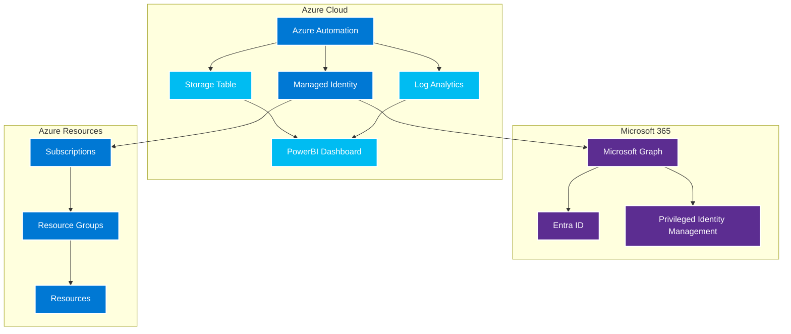

# Azure Role Assignment Monitoring Solution

## Overview

This solution provides comprehensive monitoring of Azure and Entra ID role assignments, including:

- **Azure RBAC Role Assignments** - Monitor Azure subscription and resource-level role assignments
- **Entra ID Role Assignments** - Monitor directory roles and administrative units
- **Privileged Identity Management (PIM)** - Monitor eligible and active role assignments
- **Change Tracking** - Track role assignment changes over time
- **Compliance Reporting** - Generate compliance reports for auditing
- **Alerting** - Send notifications for unauthorized or suspicious role assignments

## Features

### Core Monitoring
- **Real-time Monitoring** - Continuous monitoring of role assignments
- **Historical Tracking** - Track changes over time with detailed audit logs
- **Multi-Tenant Support** - Monitor multiple Azure tenants and subscriptions
- **Cross-Platform** - Supports both Azure and Entra ID role assignments

### Advanced Features
- **Anomaly Detection** - Identify unusual role assignment patterns
- **Risk Assessment** - Evaluate the risk level of role assignments
- **Automated Remediation** - Automatically remove unauthorized assignments
- **Custom Policies** - Define custom rules for role assignment governance

### Reporting & Analytics
- **PowerBI Dashboard** - Comprehensive visualization and analytics
- **Compliance Reports** - Generate reports for SOX, PCI, and other frameworks
- **Executive Summaries** - High-level reporting for management
- **Detailed Audit Logs** - Comprehensive logging for forensic analysis

## Architecture

The solution follows a similar architecture to the Inactivity Management solution:



## Quick Start

### 1. Prerequisites
- Azure subscription with appropriate permissions
- Azure Automation Account
- Microsoft Graph API permissions
- PowerShell 5.1 or later

### 2. Installation
```powershell
# Install prerequisites
.\Install-Prerequisites.ps1

# Set up Azure Automation
.\Setup-AzureAutomation.ps1

# Configure monitoring
.\Setup-RoleMonitoring.ps1
```

### 3. Configuration
Edit the configuration file to specify:
- Azure subscriptions to monitor
- Entra ID tenants to monitor
- Role assignment policies
- Alerting thresholds

## Files Structure

```
RoleAssignmentMonitoring/
├── Scripts/
│   ├── AzureAutomation-RoleMonitoring.ps1    # Main monitoring runbook
│   ├── Monitor-AzureRoles.ps1                # Azure RBAC monitoring
│   ├── Monitor-EntraRoles.ps1                # Entra ID role monitoring
│   ├── Monitor-PIMRoles.ps1                  # PIM monitoring
│   └── Generate-ComplianceReport.ps1         # Compliance reporting
├── Setup/
│   ├── Setup-AzureAutomation.ps1             # Azure Automation setup
│   ├── Setup-RoleMonitoring.ps1              # Role monitoring setup
│   ├── Setup-Permissions.ps1                 # Permission configuration
│   └── Install-Prerequisites.ps1             # Module installation
├── Config/
│   ├── Config-RoleMonitoring.ps1             # Main configuration
│   ├── Config-Policies.ps1                   # Role assignment policies
│   └── Config-Alerting.ps1                   # Alerting configuration
├── PowerBI/
│   ├── Dashboard-Setup.md                    # Dashboard setup guide
│   ├── Template-Guide.md                     # Template documentation
│   └── Data-Connector.md                     # Data connection setup
├── Tests/
│   ├── AzureAutomation-RoleMonitoring.Tests.ps1
│   ├── Monitor-AzureRoles.Tests.ps1
│   ├── Monitor-EntraRoles.Tests.ps1
│   └── Test-Runner.ps1
├── Documentation/
│   ├── README.md                             # This file
│   ├── Architecture-Guide.md                 # Architecture documentation
│   ├── Configuration-Guide.md               # Configuration guide
│   ├── Troubleshooting-Guide.md             # Troubleshooting guide
│   └── API-Reference.md                      # API documentation
└── Templates/
    ├── ARM-Templates/                        # Azure Resource Manager templates
    ├── PowerBI-Templates/                    # PowerBI dashboard templates
    └── Policy-Templates/                     # Role assignment policy templates
```

## Key Components

### 1. Azure RBAC Monitoring
- Monitor role assignments at subscription, resource group, and resource levels
- Track built-in and custom role assignments
- Detect elevation of privileges and unauthorized assignments

### 2. Entra ID Role Monitoring
- Monitor directory roles and administrative units
- Track role assignments for users, groups, and service principals
- Monitor application permissions and consent grants

### 3. PIM Monitoring
- Track eligible and active role assignments
- Monitor activation requests and approvals
- Alert on unusual activation patterns

### 4. Change Tracking
- Maintain historical records of all role assignment changes
- Track who made changes, when, and what was changed
- Provide audit trails for compliance requirements

### 5. Compliance Reporting
- Generate reports for various compliance frameworks
- Provide executive summaries and detailed audit logs
- Support for automated compliance checks

## Security Considerations

- **Least Privilege Access** - Uses managed identity with minimal required permissions
- **Secure Storage** - All data encrypted at rest and in transit
- **Audit Logging** - Comprehensive logging of all monitoring activities
- **Access Control** - Role-based access to monitoring data and reports

## Getting Started

1. **Review Prerequisites** - Ensure you have the required permissions and resources
2. **Install Dependencies** - Run the installation scripts to set up required modules
3. **Configure Monitoring** - Edit configuration files to specify what to monitor
4. **Deploy Solution** - Run setup scripts to deploy to Azure Automation
5. **Test and Validate** - Use the test suite to validate the deployment
6. **Set Up Dashboards** - Configure PowerBI dashboards for visualization

## Support

For issues and questions:
- Check the troubleshooting guide
- Review the documentation
- Use the test suite to validate configuration
- Check Azure Automation logs for errors

## Contributing

When contributing to this solution:
1. Follow the existing code structure and naming conventions
2. Add appropriate tests for new functionality
3. Update documentation for any changes
4. Ensure compliance with security best practices

## License

This solution is provided under the same license as the IAM repository.
